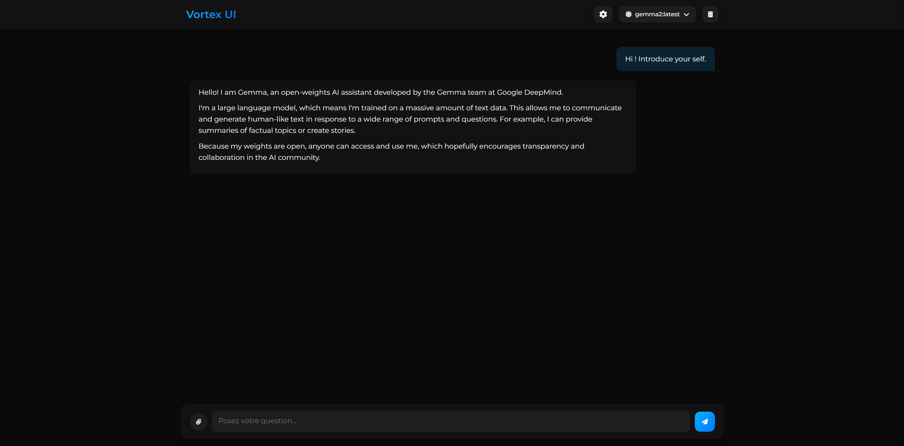

# Ollama Vortex UI

Ollama Vortex UI is a modern and intuitive user interface for interacting with language models via the Ollama API. This interface offers a smooth and customizable experience, allowing users to chat with language models, manage conversations, and customize the appearance of the interface.



## Features

### Main Features

1. **Interactive Chat**: Chat with language models in real-time. The interface supports response streaming for a seamless experience.
2. **Model Management**: Easily select and switch between available language models via the Ollama API.
3. **Conversation Reset**: Reset the conversation at any time to start a new session.
4. **Interface Customization**: Change the interface theme (light or dark) and customize the system prompt to tailor the model's responses.
5. **Real-Time Statistics**: View detailed statistics on generated responses, including response time, token count, and generation speed.
6. **Generation Interruption**: Interrupt text generation at any time if the response is not satisfactory.
7. **Response Copying**: Easily copy generated responses to your clipboard.
8. **Response Regeneration**: Regenerate the last response to get an alternative version.

### Additional Features

- **Typing Indicator**: A visual indicator shows when the model is generating a response.
- **Toast Notifications**: Contextual notifications inform the user of successful actions or errors.
- **File Management**: A file upload feature is under development to allow interaction with documents.

## Installation

### Prerequisites

- Node.js (version 16 or higher)
- npm (usually installed with Node.js)
- A running Ollama server (available at `http://127.0.0.1:11434` by default)

### Installation Steps

1. **Clone the repository**:
   ```bash
   git clone https://github.com/Dorian2B/Ollama-Vortex-UI
   cd Ollama-Vortex-UI
   ```

2. **Install dependencies**:
   ```bash
   npm install
   ```

3. **Start the server**:
   ```bash
   npm start
   ```

4. **Access the interface**:
   Open your browser and go to `http://localhost:3000`.

## Usage

### User Interface

1. **Model Selection**: Click the "Model" button at the top right to select a language model from the available options.
2. **Sending Messages**: Type your message in the text box at the bottom of the screen and press "Enter" or click the send button.
3. **Resetting the Conversation**: Click the "Reset" button to clear the current conversation and start over.
4. **Theme Switching**: Access the settings by clicking the gear icon at the top right to switch between light and dark themes.
5. **Interrupting Generation**: If text generation takes too long or is unsatisfactory, click the "Interrupt" button to stop generation.

### Customization

- **System Prompt**: You can set a system prompt in the settings to guide the model's responses.
- **Theme**: The interface supports two themes (light and dark) that you can switch at any time.

## Development

### Project Structure

- **`index.html`**: The main HTML file that structures the user interface.
- **`styles.css`**: The CSS file that manages the style and appearance of the interface.
- **`script.js`**: The JavaScript file that handles the interface logic, including interactions with the Ollama API.
- **`server.js`**: The Node.js server that serves the interface and handles requests to the Ollama API.

### Dependencies

- **Express**: Web framework for Node.js used to serve the interface and manage routes.
- **Socket.IO**: Handles real-time communication between the client and server.
- **Axios**: Used to make HTTP requests to the Ollama API.
- **Marked**: Library for converting Markdown to HTML, used to display model responses.

## Author

- **Dorian Dominici** - [Dorian2B](https://github.com/Dorian2B)

## Acknowledgments

- Thanks to the Ollama team for their language model API.
- Thanks to the open-source community for the many libraries used in this project.

---

Feel free to explore the code, report issues, or suggest improvements. Enjoy using Ollama Vortex UI! 🚀
